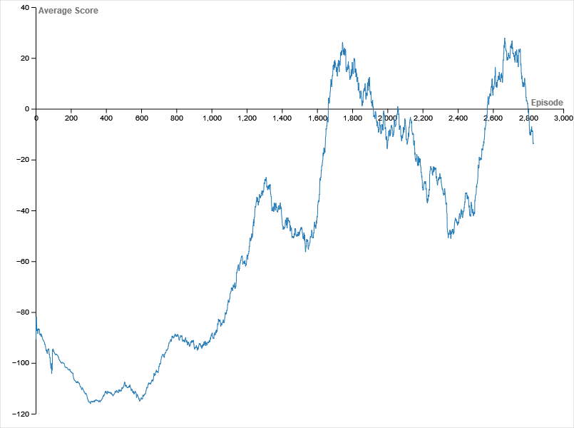

Proyecto de Godot v3.5.3-stable.

Necesario descargar el addon [PythonScript](https://godotengine.org/asset-library/asset/179) y en la carpeta del sistema operativo correspondiente activar estos comandos:

```
python.exe -m ensurepip
python.exe -m pip install torch
python.exe -m pip install numpy
```

Luego reiniciar Godot. La red neuronal se encuentra en `AI.py` y el script encargado de enviar las observaciones es `Scenes/ai_environment.gd`. El juego es un juego viejo mío que ya estaba programado.

Recursos utilizados: 
- https://youtu.be/wc-FxNENg9U 
- https://github.com/xen-42/Godot-snake-AI

Un video de la IA jugando en el episodio 2835 apróx.
<video controls src="Neural Network.mp4" title="Title"></video>

Puntaje promedio a través de los episodios:
